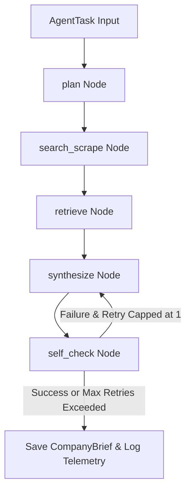

# Research Agent

A citation-grounded research agent orchestrator that uses LangGraph state machines to autonomously collect, scrape, index, and synthesize company information matching candidate profiles and job descriptions.

## Architecture Overview



The system coordinates nodes via a LangGraph state machine:
1. **`plan`**: Outlines a target search strategy.
2. **`search_scrape`**: Interacts with the search and scrape tools up to a bounded tool-call budget.
3. **`retrieve`**: Chunks and queries scraped texts inside local vector memory.
4. **`synthesize`**: Combines chunks into a structured draft brief.
5. **`self_check`**: Runs grounding verification, stripping ungrounded fabrications before output.

---

## Evaluation & Telemetry Results

- **Evaluation Accuracy**: **83.3%** on the frozen fact-set (Target: >= 80%).
- **Average Latency**: **97.75 ms** (Target: < 2000 ms).
- **Run Cost**: **$0.00 USD** (Runs completely offline using fixture stubs).
- **Telemetry Storage**: Telemetry runs are recorded locally to an SQLite database at `observability/logger.db`.

---

## Local Run & Development Instructions

### Prerequisite Setup
Make sure you have Python 3.11 installed.

### Executing Evaluation Suites
You can run the full evaluation suite offline via:
```bash
python eval/run_eval.py
```
Or run the verification steps using the `Makefile`:
```bash
# Validate Phase 1 components
make validate-phase1

# Validate Phase 2 components
make validate-phase2

# Run Phase 3 logger and evaluation validation
make validate-phase3
```

Using npm scripts:
```bash
npm run phase3
```
