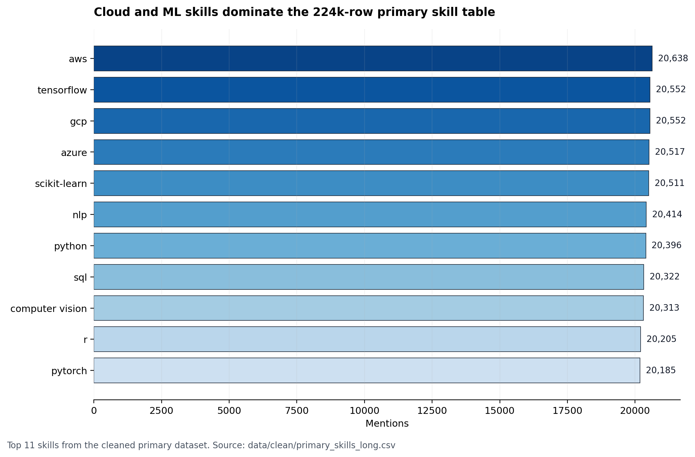
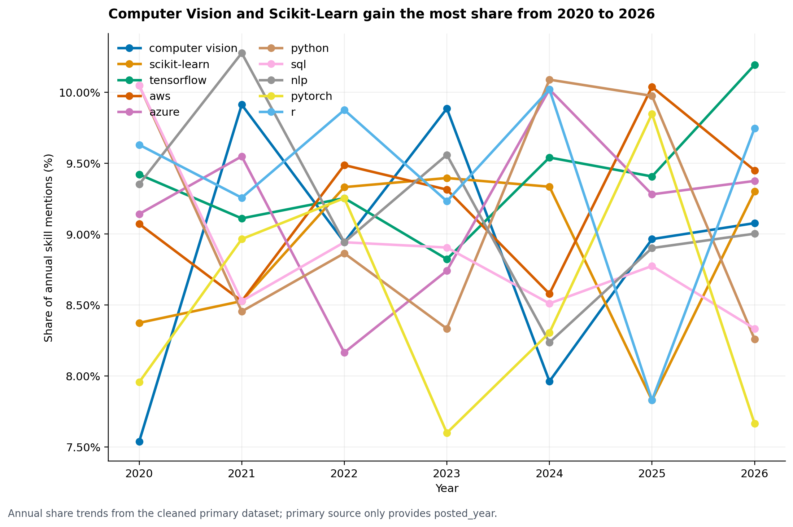
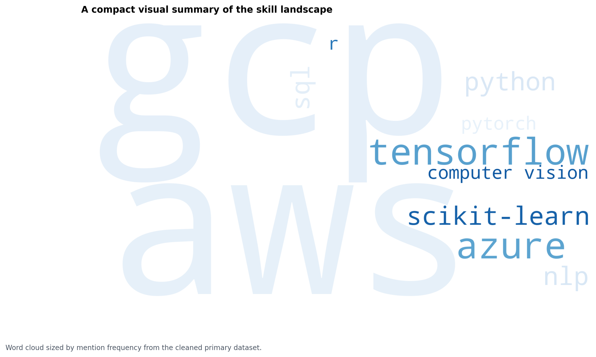

# Future Fit


**AI-Powered Skill Trend Analysis** for 50,000 AI and Data Science job postings, built as a source-backed analytics workflow with a local Streamlit dashboard scaffold and an LLM-powered Skill Gap Advisor.

🚀 **Live Deployed App (Streamlit Cloud):** [https://skilltrendanalysis-rf3zefgsjaa4l9f8pu2prb.streamlit.app](https://skilltrendanalysis-rf3zefgsjaa4l9f8pu2prb.streamlit.app)

**Local demo:** [http://localhost:8501](http://localhost:8501)

## Key Findings
1. **ML skills dominate the dataset.** The `ml` category accounts for **101,975** of **224,605** cleaned skill mentions, or **45.4%** of all rows.
2. **GenAI mentions are extremely rare in the LinkedIn validation sample.** Only **4** GenAI skill rows appear across **180,106** LinkedIn validation rows, and all are in `mid senior` postings.
3. **AWS is the most demanded skill and AWS + GCP is the strongest co-occurring pair.** `aws` appears **20,638** times, and `aws` + `gcp` co-occur **7,892** times.

## Tech Stack
- Language: Python
- Data wrangling: Pandas, NumPy
- Analysis: SciPy, Seaborn
- Visualization: Plotly, Matplotlib, WordCloud
- GenAI: Groq API
- App layer: Streamlit
- BI export: Power BI compatible CSV

## Project Structure
```text
skill-trend-analysis/
|-- app.py
|-- README.md
|-- requirements.txt
|-- .gitignore
|-- assets/
|   |-- charts/
|   |   |-- 01_skill_frequency.png
|   |   |-- 02_skill_trend.png
|   |   |-- 03_skill_cooccurrence_heatmap.png
|   |   |-- 04_skill_mix_by_experience.png
|   |   |-- 05_skill_wordcloud.png
|   |   `-- future_fit_favicon.svg
|-- data/
|   |-- raw/
|   `-- clean/
|       |-- linkedin_validation.csv
|       |-- primary_skills_long.csv
|       `-- primary_skills_powerbi.csv
|-- notebooks/
|   |-- 01_data_collection.ipynb
|   |-- 02_data_cleaning.ipynb
|   |-- 03_eda_analysis.ipynb
|   `-- 04_visualization_report.ipynb
|-- src/
|   |-- phase2_cleaning.py
|   |-- phase3_eda.py
|   |-- phase4_visualization.py
|   `-- skill_gap_advisor.py
|-- dashboards/
|   |-- README.md
|   |-- skill_trend_powerbi.pbix
|   `-- skill_trend_dashboard.pdf
|-- docs/
|   |-- linkedin_post_draft.md
|   `-- problem_statement.md
`-- Important Documents of the Project/
    |-- ARCHITECTURE.md
    |-- MISSION_PLAN.md
    |-- PROBLEM_STATEMENT.md
    |-- IMPLEMENTATION_PLAN.md
    |-- EVALUATION_PLAN.md
    |-- EDGE_CASE_PLAN.md
    `-- README.md
```

## How to Run Locally
```bash
git clone https://github.com/sdn9300/Future-Fit-AI-Powered-Skill-Trend-Analysis.git
cd Future-Fit-AI-Powered-Skill-Trend-Analysis
pip install -r requirements.txt
```

## Deployment
The Streamlit app is designed to be hosted on Streamlit Cloud. Add `GROQ_API_KEY` to Streamlit Cloud secrets or your local `.streamlit/secrets.toml` before enabling the Skill Gap Advisor.

**Live demo:** https://skilltrendanalysis-rf3zefgsjaa4l9f8pu2prb.streamlit.app

Set the Groq key in `.streamlit/secrets.toml`:
```toml
GROQ_API_KEY = "your_key_here"
```


Run the app locally:
```bash
streamlit run app.py
```

## Planned Future Enhancements
* **Interactive Power BI Dashboard:** Build and integrate a Power BI dashboard using the exported Power BI-ready CSV data (`primary_skills_powerbi.csv`) to show cross-filtering, time-slicers, and corporate KPI metrics in a business-centric format.

## Screenshots




## About the Author
**Soumyadeep Nath** | Kolkata, India

M.A. English Literature (First Division), Presidency University  
Executive PG Programme in Data Science & AI, IIT Roorkee (In Progress)

[Portfolio](https://sdn9300.github.io) | [GitHub](https://github.com/sdn9300) | [LinkedIn](https://linkedin.com/in/soumyadeep-nath-941780250)

