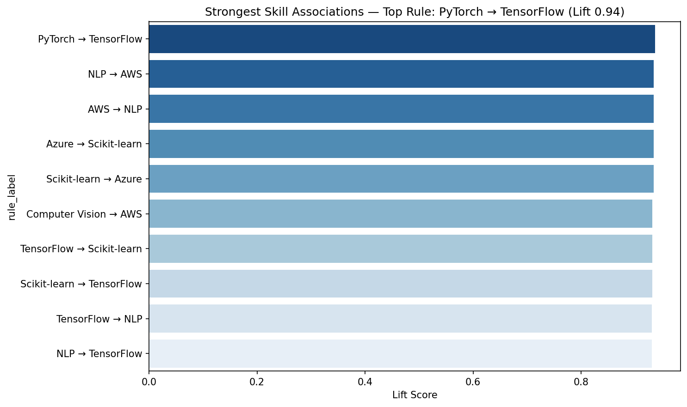
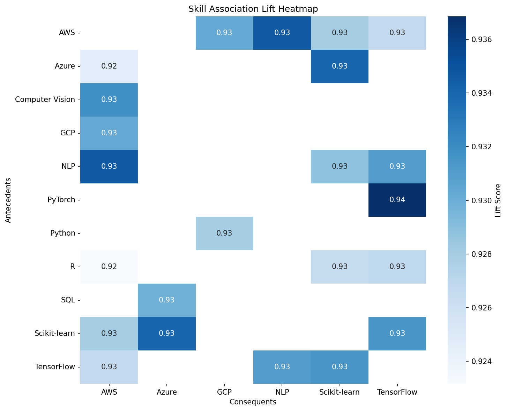

# Future Fit


**AI-Powered Skill Trend Analysis** for 50,000 AI and Data Science job postings, built as a source-backed analytics workflow with a local Streamlit dashboard scaffold, an LLM-powered Skill Gap Advisor, and a Market Basket Analysis engine for discovering co-occurring skill pairs.

🚀 **Live Deployed App (Streamlit Cloud):** [https://skilltrendanalysis-rf3zefgsjaa4l9f8pu2prb.streamlit.app](https://skilltrendanalysis-rf3zefgsjaa4l9f8pu2prb.streamlit.app)

**Local demo:** [http://localhost:8501](http://localhost:8501)

---

## Key Findings
1. **ML skills dominate the dataset.** The `ml` category accounts for **101,975** of **224,605** cleaned skill mentions, or **45.4%** of all rows.
2. **GenAI mentions are extremely rare in the LinkedIn validation sample.** Only **4** GenAI skill rows appear across **180,106** LinkedIn validation rows, and all are in `mid senior` postings.
3. **AWS is the most demanded skill and AWS + GCP is the strongest co-occurring pair.** `aws` appears **20,638** times, and `aws` + `gcp` co-occur **7,892** times.
4. **Market Basket Analysis reveals 230 frequent skill itemsets** across 50,000 jobs. The strongest co-occurrence rule is `PyTorch → TensorFlow` (lift 0.94, support 15.5%) — reflecting that these frameworks act as near-substitutes while consistently requested together.

---

## Tech Stack
| Layer | Tools |
|:------|:------|
| Language | Python 3.11 |
| Data wrangling | Pandas, NumPy |
| Statistical analysis | SciPy, mlxtend (Apriori / Association Rules) |
| Visualization | Plotly, Matplotlib, Seaborn, WordCloud |
| GenAI / LLM | Groq API (llama3-8b-8192) |
| App layer | Streamlit |
| BI export | Power BI-compatible CSV |

---

## Streamlit Dashboard Panels

| Tab | Panel | Description |
|:----|:------|:------------|
| 1 | 📊 Overview | Skill frequency rankings, category breakdown, LinkedIn validation cross-check |
| 2 | 📈 Trend Explorer | Year-over-year skill share trends with interactive filters |
| 3 | 🔥 Skill Heatmap | Co-occurrence heatmap of top skill pairs by experience level |
| 4 | 🧠 Skill Gap Advisor | LLM-powered learning path via Groq, enriched with MBA association insights |
| 5 | 🛒 Skill Associations | Market Basket Analysis — interactive rules table + lift bar chart |

---

## Market Basket Analysis (Phase 5)

Using the **Apriori algorithm** (`mlxtend`) on all 50,000 job postings:

- **Wide-format encoding:** one row per job, skill list as a basket.
- **One-hot matrix:** 50,000 × 11 boolean matrix (all 11 unique skills retained).
- **Frequent itemsets:** 230 itemsets discovered at `min_support=0.05`.
- **Association rules:** 23 rules surviving `lift ≥ 0.90`, `confidence ≥ 0.38`.
- **Skill Gap Advisor enrichment:** The advisor now appends the top matching association rule into the Groq prompt (e.g. typing `AWS` surfaces the `AWS → NLP` rule at 38% confidence).

**Key outputs:**

| File | Description |
|:-----|:------------|
| `data/clean/primary_wide.csv` | One row per job with skill list |
| `data/clean/primary_onehot.csv` | Boolean one-hot skill matrix |
| `data/clean/mba_rules.csv` | 23 filtered association rules |
| `assets/charts/06_mba_top_rules.png` | Top-10 rules bar chart by lift |
| `assets/charts/07_mba_rules_heatmap.png` | Skill × skill lift heatmap |
| `src/market_basket.py` | Reusable pipeline module |
| `notebooks/05_market_basket_analysis.ipynb` | Full Apriori walkthrough notebook |

---

## Project Structure
```text
Future-Fit-AI-Powered-Skill-Trend-Analysis/
|-- app.py                          # Streamlit multi-tab dashboard (5 panels)
|-- README.md
|-- requirements.txt                # pandas, plotly, streamlit, mlxtend, groq …
|-- .gitignore
|-- assets/
|   `-- charts/
|       |-- 01_skill_frequency.png
|       |-- 02_skill_trend.png
|       |-- 03_skill_cooccurrence_heatmap.png
|       |-- 04_skill_mix_by_experience.png
|       |-- 05_skill_wordcloud.png
|       |-- 06_mba_top_rules.png        ← NEW: Top-10 association rules by lift
|       `-- 07_mba_rules_heatmap.png    ← NEW: Skill × skill lift heatmap
|-- data/
|   |-- raw/
|   `-- clean/
|       |-- linkedin_validation.csv
|       |-- primary_skills_long.csv
|       |-- primary_skills_powerbi.csv
|       |-- primary_wide.csv            ← NEW: wide-format basket input
|       |-- primary_onehot.csv          ← NEW: boolean one-hot matrix
|       `-- mba_rules.csv               ← NEW: association rules output
|-- notebooks/
|   |-- 01_data_collection.ipynb
|   |-- 02_data_cleaning.ipynb
|   |-- 03_eda_analysis.ipynb
|   |-- 04_visualization_report.ipynb
|   `-- 05_market_basket_analysis.ipynb ← NEW: full Apriori walkthrough
|-- src/
|   |-- market_basket.py                ← NEW: reusable MBA pipeline module
|   |-- run_apriori.py                  ← NEW: standalone script + chart generator
|   |-- phase2_cleaning.py
|   |-- phase3_eda.py
|   |-- phase4_visualization.py
|   |-- prepare_onehot_data.py
|   |-- prepare_wide_data.py
|   |-- prepare_powerbi_data.py
|   `-- skill_gap_advisor.py            ← UPDATED: mba_rules enrichment
|-- dashboards/
|   |-- README.md
|   |-- skill_trend_powerbi.pbix
|   `-- skill_trend_dashboard.pdf
|-- docs/
|   |-- linkedin_post_draft.md
|   `-- problem_statement.md
`-- Important Documents of the Project/
    |-- ARCHITECTURE.md
    |-- MISSION_PLAN.md
    |-- PROBLEM_STATEMENT.md
    |-- IMPLEMENTATION_PLAN.md
    |-- EVALUATION_PLAN.md
    |-- EDGE_CASE_PLAN.md
    `-- README.md
```

---

## How to Run Locally
```bash
git clone https://github.com/sdn9300/Future-Fit-AI-Powered-Skill-Trend-Analysis.git
cd Future-Fit-AI-Powered-Skill-Trend-Analysis
pip install -r requirements.txt
streamlit run app.py
```

---

## Deployment
The Streamlit app is hosted on Streamlit Cloud. Add `GROQ_API_KEY` to Streamlit Cloud secrets or your local `.streamlit/secrets.toml` to enable the live Skill Gap Advisor.

**Live demo:** https://skilltrendanalysis-rf3zefgsjaa4l9f8pu2prb.streamlit.app

```toml
# .streamlit/secrets.toml
GROQ_API_KEY = "your_key_here"
```

---

## Screenshots





---

## Planned Future Enhancements
- **Interactive Power BI Dashboard:** Build and integrate a Power BI dashboard using the exported Power BI-ready CSV (`primary_skills_powerbi.csv`) to show cross-filtering, time-slicers, and corporate KPI metrics.
- **Expanded MBA corpus:** Re-run Apriori on a richer multi-source dataset to surface lift values above 1.0 for stronger, more actionable skill pairing rules.
- **Temporal association rules:** Slice the basket analysis by year to detect which skill pairings are emerging versus declining.

---

## About the Author
**Soumyadeep Nath** | Kolkata, India

M.A. English Literature (First Division), Presidency University
Executive PG Programme in Data Science & AI, IIT Roorkee (In Progress)

[Portfolio](https://sdn9300.github.io) | [GitHub](https://github.com/sdn9300) | [LinkedIn](https://linkedin.com/in/soumyadeep-nath-941780250)
